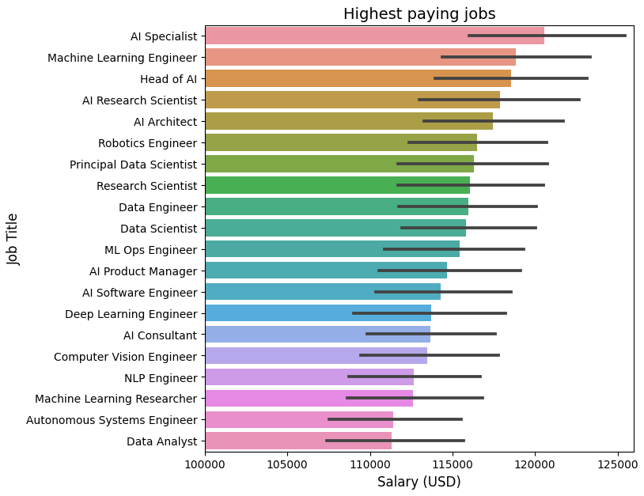
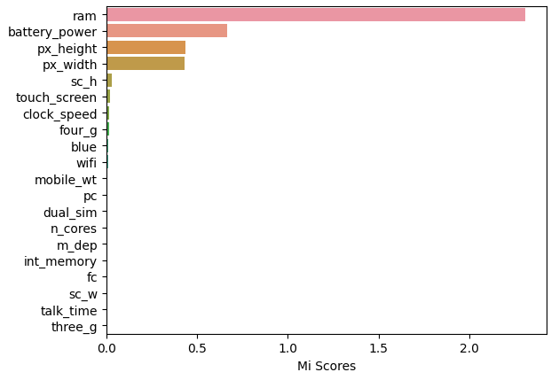
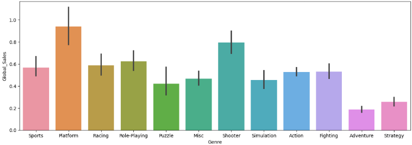

# Data Scientist

#### Technical Skills: Python, SQL, Machine Learning, Matlab, Pandas, Scikit-Learn, Feature Engineering, Deep Learning, Data Analysis, Statistics

## Projects
### Exploratory Data Analysis - Global AI Job Market
[Link](https://github.com/Zunku/Global-AI-Job-Market)

Conducted an in-depth exploratory analysis of the AI job market using real-world datasets. Uncovered trends in salaries, top hiring companies, and industry sectors. Identified high-paying roles, most in-demand skills, and geographical salary patterns. Delivered insights through visualizations and clear data storytelling to highlight market dynamics and career opportunities in AI.

### Machine Learning Explainability - Phone Price Classifier
[Link](https://github.com/Zunku/Phone-Price-Classifier)

Performed EDA and feature engineering to train a Random Forest Classifier predicting mobile phone price ranges. The project focused on model explainability, using visual tools and feature importance to clearly communicate how the model makes decisions — even to non-technical audiences.

### EDA & Feature Engineering – Video Game Sales
[Link](https://github.com/Zunku/Videogames-Sales)

Performed exploratory data analysis on global video game sales, identifying trends across genres, platforms, and release years. Engineered key features to improve predictive modeling. Insights revealed market shifts over time, top-performing franchises, and genre-specific sales behaviors. Optimized the dataset for use in machine learning pipelines.

