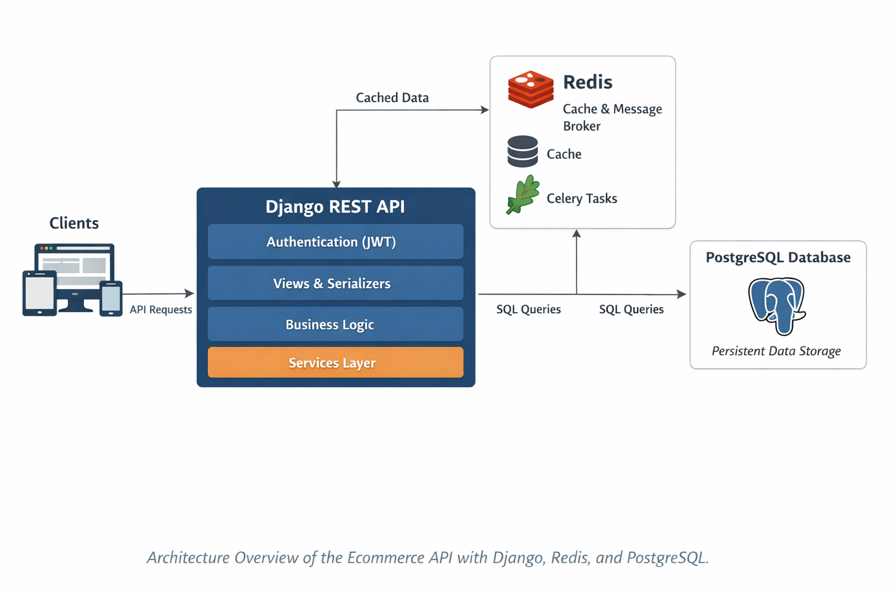
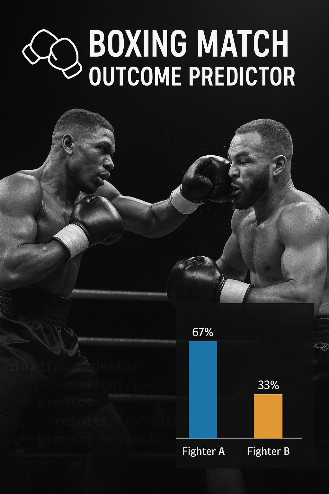
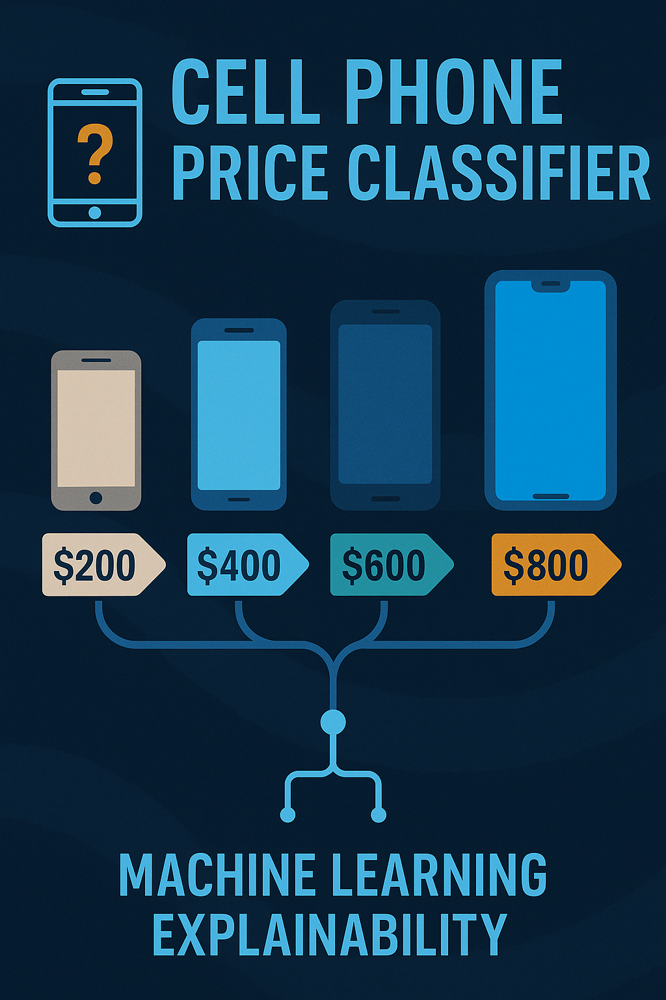
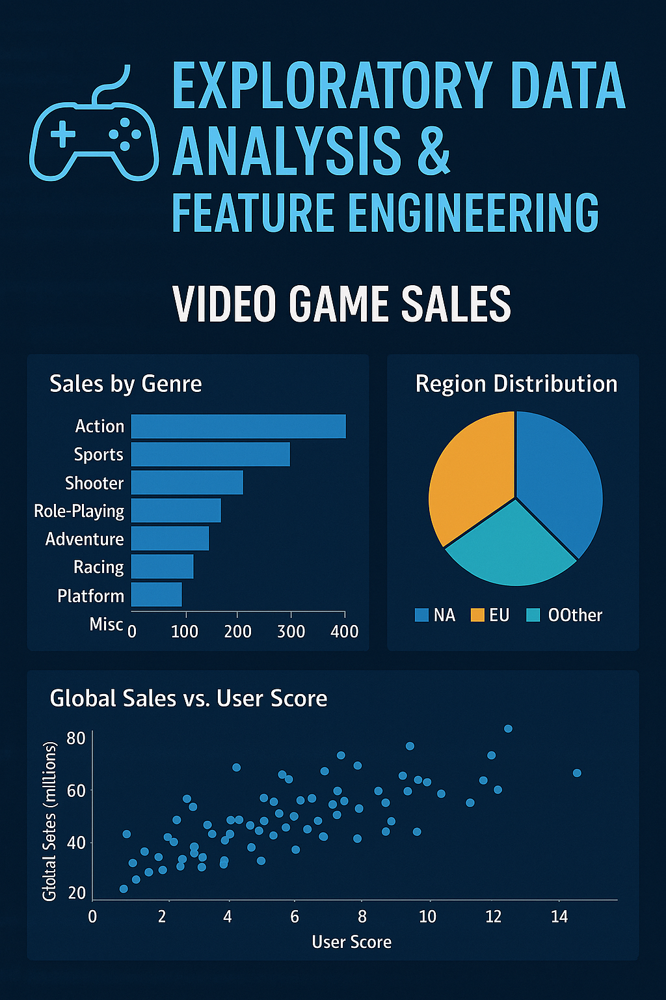

# Backend Engineer

#### Technical Skills: Python, SQL, Cloud, Azure, Docker, Git, API Rest, Testing, Machine Learning

## Projects
### Ecommerce Django - Django REST Backend
[Link](https://github.com/Zunku/ecommece-django)

A production-oriented e-commerce backend built with Django REST Framework.
It exposes a secure and scalable API for managing products, collections, carts, and orders, with role-based permissions and robust validation. The system integrates PostgreSQL for data integrity, Redis for caching, Celery for background tasks, and JWT for stateless authentication. Performance and reliability were validated using automated tests with pytest and load testing with Locust, ensuring the API behaves correctly under real-world conditions.

### SentimentScope - Sentiment Classifier
[Link](https://github.com/Zunku/sentiment-scope)

SentimentScope is an end-to-end sentiment analysis (NLP) project designed to demonstrate real-world machine learning engineering and MLOps skills. From exploratory data analysis to automated cloud retraining pipelines, this project showcases the full lifecycle of an ML system: exploration, modeling, deployment, monitoring, and scalability.

### Boxing Matches Winner Predictor
[Link](https://github.com/Zunku/Boxing-Matches-Outcome-Predictions)

Developed a predictive analytics model to forecast boxing match outcomes using historical fight data, fighter statistics, and advanced machine learning algorithms. Designed an end-to-end pipeline for automation and integrated machine learning explainability techniques, delivering actionable insights to support strategic decision-making for promoters, bettors, and sports analysts, minimizing financial risk and maximizing engagement.

### Global AI Job Market - Exploratory Data Analysis
[Link](https://github.com/Zunku/Global-AI-Job-Market)

Conducted an in-depth exploratory analysis of the AI job market using real-world datasets. Uncovered trends in salaries, top hiring companies, and industry sectors. Identified high-paying roles, most in-demand skills, and geographical salary patterns. Delivered insights through visualizations and clear data storytelling to highlight market dynamics and career opportunities in AI.

### Phone Price Classifier - Machine Learning Explainability
[Link](https://github.com/Zunku/Phone-Price-Classifier)

Performed EDA and feature engineering to train a Random Forest Classifier predicting mobile phone price ranges. The project focused on model explainability, using visual tools and feature importance to clearly communicate how the model makes decisions — even to non-technical audiences.

### Video Game Sales - EDA & Feature Engineering
[Link](https://github.com/Zunku/Videogames-Sales)

Performed exploratory data analysis on global video game sales, identifying trends across genres, platforms, and release years. Engineered key features to improve predictive modeling. Insights revealed market shifts over time, top-performing franchises, and genre-specific sales behaviors. Optimized the dataset for use in machine learning pipelines.

